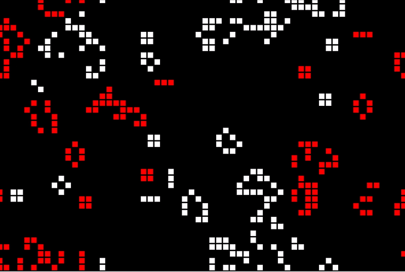

# Game-of-Life-Simulator
Modified from a previous tutorial given by: The Coding Train https://www.youtube.com/watch?v=FWSR_7kZuYg. Modifications include:
* Red and white colors and different behavoirs associated with the differently colored pixels.
* White can kill other reds if there are 2 or more white pixels surrounding a red pixel.
* Red pixels can convert white pixels if there are three or more around a white pixel. 
* Previous rules of the original Game of Life apply: Ie. 2 pixels next to each other create a new pixel, one dies on its own, and being surrounded by four pixels kills a pixel.

## Demo

